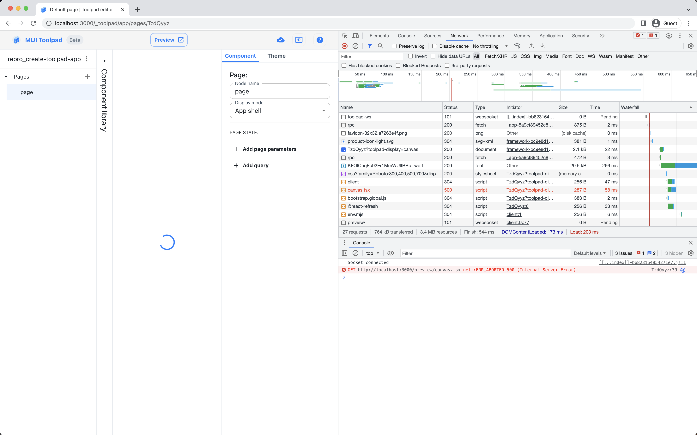

### pnpm dlx create-toolpad-app repro_create-toolpad-app
```
.../Library/pnpm/store/v3/tmp/dlx-89632  |  +92 +++++++++
.../Library/pnpm/store/v3/tmp/dlx-89632  | Progress: resolved 92, reused 92, downloaded 0, added 92, done

info - Creating Toolpad project in /Users/nicu/dev/my/legis_gpt/repro_create-toolpad-app

info - Initializing package.json file
info - Initializing .gitignore file
info - Installing dependencies

 WARN  deprecated sourcemap-codec@1.4.8: Please use @jridgewell/sourcemap-codec instead
 WARN  deprecated string-at@1.1.0: The original `String.prototype.at` proposal has been replaced by a new one; please use v1 or later of `string.prototype.at` instead
Packages: +725
+++++++++++++++++++++++++++++++++++++++++++++++++++++++++++++++++++++++++++++++++++++++++++++++++++++++++
Packages are hard linked from the content-addressable store to the virtual store.
  Content-addressable store is at: /Users/nicu/Library/pnpm/store/v3
  Virtual store is at:             node_modules/.pnpm
Progress: resolved 775, reused 725, downloaded 0, added 725, done

dependencies:
+ @mui/toolpad 0.1.18

 WARN  Issues with peer dependencies found
.
└─┬ @mui/toolpad 0.1.18
  └─┬ @mui/toolpad-app 0.1.18
    ├─┬ react-inspector 5.1.1
    │ └── ✕ unmet peer react@"^16.8.4 || ^17.0.0": found 18.2.0 in @mui/toolpad-app
    └─┬ react-split-pane 0.1.92
      ├── ✕ unmet peer react@^16.0.0-0: found 18.2.0 in @mui/toolpad-app
      └── ✕ unmet peer react-dom@^16.0.0-0: found 18.2.0 in @mui/toolpad-app

Done in 29.3s

success - Dependencies installed successfully!

Run the following to get started:

  cd repro_create-toolpad-app
  pnpm run dev
```

### cd ./repro_create-toolpad-app/

### pnpm run dev
```
> repro_create-toolpad-app@0.1.0 dev /Users/nicu/dev/my/legis_gpt/repro_create-toolpad-app
> toolpad dev

info  - starting Toolpad application in dev mode...
info  - Initializing .gitignore file
info  - loaded env file "/Users/nicu/dev/my/legis_gpt/repro_create-toolpad-app/.env" with keys
ready - built functions.ts: 0 error(s), 0 warning(s)
Failed to resolve dependency: @emotion/cache, present in 'optimizeDeps.include'
Failed to resolve dependency: @emotion/react, present in 'optimizeDeps.include'
Cannot optimize dependency: @mui/icons-material/ArrowDropDownRounded, present in 'optimizeDeps.include'
Cannot optimize dependency: @mui/icons-material/DarkMode, present in 'optimizeDeps.include'
Cannot optimize dependency: @mui/icons-material/Edit, present in 'optimizeDeps.include'
Cannot optimize dependency: @mui/icons-material/Error, present in 'optimizeDeps.include'
Cannot optimize dependency: @mui/icons-material/HelpOutlined, present in 'optimizeDeps.include'
Cannot optimize dependency: @mui/icons-material/LightMode, present in 'optimizeDeps.include'
Cannot optimize dependency: @mui/icons-material/OpenInNew, present in 'optimizeDeps.include'
Cannot optimize dependency: @mui/icons-material/SettingsBrightnessOutlined, present in 'optimizeDeps.include'
Failed to resolve dependency: @mui/lab, present in 'optimizeDeps.include'
Failed to resolve dependency: @mui/material, present in 'optimizeDeps.include'
Failed to resolve dependency: @mui/material/Button, present in 'optimizeDeps.include'
Failed to resolve dependency: @mui/material/colors, present in 'optimizeDeps.include'
Failed to resolve dependency: @mui/material/styles, present in 'optimizeDeps.include'
Failed to resolve dependency: @mui/material/useMediaQuery, present in 'optimizeDeps.include'
Failed to resolve dependency: @mui/utils, present in 'optimizeDeps.include'
Failed to resolve dependency: @mui/x-data-grid-pro, present in 'optimizeDeps.include'
Failed to resolve dependency: @mui/x-date-pickers/AdapterDayjs, present in 'optimizeDeps.include'
Failed to resolve dependency: @mui/x-date-pickers/DesktopDatePicker, present in 'optimizeDeps.include'
Failed to resolve dependency: @mui/x-date-pickers/LocalizationProvider, present in 'optimizeDeps.include'
Failed to resolve dependency: @tanstack/react-query, present in 'optimizeDeps.include'
Failed to resolve dependency: @tanstack/react-query-devtools/build/lib/index.prod.js, present in 'optimizeDeps.include'
Failed to resolve dependency: dayjs, present in 'optimizeDeps.include'
Failed to resolve dependency: dayjs/locale/en, present in 'optimizeDeps.include'
Failed to resolve dependency: dayjs/locale/fr, present in 'optimizeDeps.include'
Failed to resolve dependency: dayjs/locale/nl, present in 'optimizeDeps.include'
Failed to resolve dependency: fractional-indexing, present in 'optimizeDeps.include'
Failed to resolve dependency: invariant, present in 'optimizeDeps.include'
Failed to resolve dependency: lodash-es, present in 'optimizeDeps.include'
Failed to resolve dependency: markdown-to-jsx, present in 'optimizeDeps.include'
Failed to resolve dependency: nanoid/non-secure, present in 'optimizeDeps.include'
Failed to resolve dependency: react, present in 'optimizeDeps.include'
Failed to resolve dependency: react-dom/client, present in 'optimizeDeps.include'
Failed to resolve dependency: react-error-boundary, present in 'optimizeDeps.include'
Failed to resolve dependency: react-hook-form, present in 'optimizeDeps.include'
Failed to resolve dependency: react-is, present in 'optimizeDeps.include'
Failed to resolve dependency: react-router-dom, present in 'optimizeDeps.include'
Failed to resolve dependency: react/jsx-dev-runtime, present in 'optimizeDeps.include'
Failed to resolve dependency: react/jsx-runtime, present in 'optimizeDeps.include'
Failed to resolve dependency: superjson, present in 'optimizeDeps.include'
Failed to resolve dependency: react, present in 'optimizeDeps.include'
Failed to resolve dependency: react/jsx-dev-runtime, present in 'optimizeDeps.include'
ready - toolpad project /Users/nicu/dev/my/legis_gpt/repro_create-toolpad-app ready on http://localhost:3000
Failed to resolve import "@mui/toolpad-app/runtime" from "/canvas.tsx". Does the file exist?
10:36:47 PM [vite] Internal server error: Failed to resolve import "@mui/toolpad-app/runtime" from "/canvas.tsx". Does the file exist?
  Plugin: vite:import-analysis
  File: /canvas.tsx:2:42
  1  |
  2  |      import { init, setComponents } from '@mui/toolpad-app/runtime';
     |                                           ^
  3  |      import { LicenseInfo } from '@mui/x-data-grid-pro';
  4  |      import components from "virtual:toolpad:components.js";
      at formatError (file:///Users/nicu/dev/my/legis_gpt/repro_create-toolpad-app/node_modules/.pnpm/vite@4.3.9_@types+node@20.3.1/node_modules/vite/dist/node/chunks/dep-e8f070e8.js:42645:46)
      at TransformContext.error (file:///Users/nicu/dev/my/legis_gpt/repro_create-toolpad-app/node_modules/.pnpm/vite@4.3.9_@types+node@20.3.1/node_modules/vite/dist/node/chunks/dep-e8f070e8.js:42641:19)
      at normalizeUrl (file:///Users/nicu/dev/my/legis_gpt/repro_create-toolpad-app/node_modules/.pnpm/vite@4.3.9_@types+node@20.3.1/node_modules/vite/dist/node/chunks/dep-e8f070e8.js:40508:33)
      at process.processTicksAndRejections (node:internal/process/task_queues:95:5)
      at async file:///Users/nicu/dev/my/legis_gpt/repro_create-toolpad-app/node_modules/.pnpm/vite@4.3.9_@types+node@20.3.1/node_modules/vite/dist/node/chunks/dep-e8f070e8.js:40651:47
      at async Promise.all (index 0)
      at async TransformContext.transform (file:///Users/nicu/dev/my/legis_gpt/repro_create-toolpad-app/node_modules/.pnpm/vite@4.3.9_@types+node@20.3.1/node_modules/vite/dist/node/chunks/dep-e8f070e8.js:40577:13)
      at async Object.transform (file:///Users/nicu/dev/my/legis_gpt/repro_create-toolpad-app/node_modules/.pnpm/vite@4.3.9_@types+node@20.3.1/node_modules/vite/dist/node/chunks/dep-e8f070e8.js:42919:30)
      at async loadAndTransform (file:///Users/nicu/dev/my/legis_gpt/repro_create-toolpad-app/node_modules/.pnpm/vite@4.3.9_@types+node@20.3.1/node_modules/vite/dist/node/chunks/dep-e8f070e8.js:53385:29)
```

<!-- Show image for Github README -->

